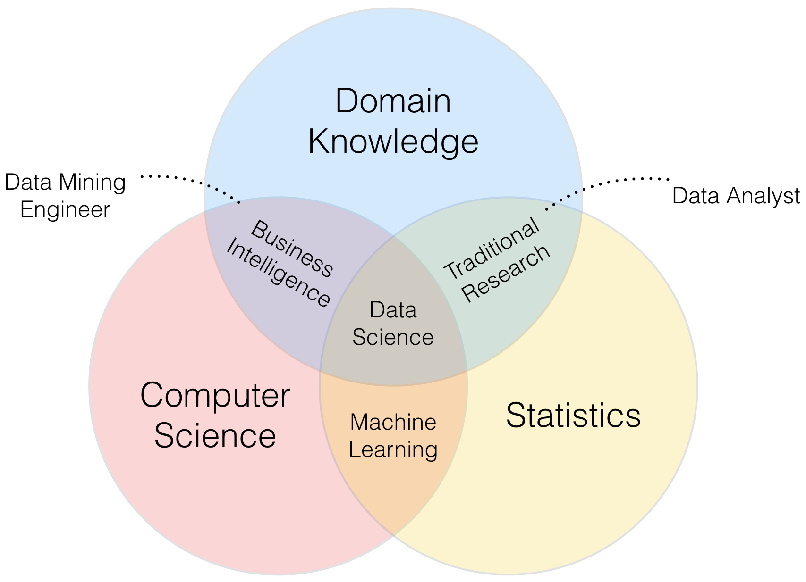

# 什么是资料科学

领域 | 说明
----|-----
統計學 | 統計是在模擬一個真實的世界，思維是基於歸納的，所有結論都來自於數據。統計學建模的前提是對真實世界提出假設，然後通過模型來描述，通過數據來支持或否定，一旦有新的模型能取代舊的模型，就能更好的分析這個真實的世界。
計算機科學 | 通過計算機實現資料儲存、生產、計算、分析。在當今的大數據時代，如果沒有很強的計算機編成能力，很多想法根本無法實現，尤其數據量很大(Volume)、多樣(Variety)、需即時反應(Velocity)時。
領域知識 | 行業裡的分析經驗，對數據本質的理解。統計為內功、計算為招式、知識為經驗。在數據科學的領域中，如果不能對需求及數據背景有深入的理解，很容易手持兩大科學利器而走向不科學的不歸路。
機器學習 | 統計與計算機的結合，不包含領域知識。在計算機能力發展到一定程度後，統計模型的驗證更為容易，因此機器學習作為一個新的學科快速崛起。由於機器學習主要通過算法實現，雖然提出模型和理解模型需要深厚數學統計背景，但應用模型非常簡單，不需像使用統計模型那樣理解所有參數的含意和檢驗結果，因此使其應用門檻很低，更容易犯錯誤。
傳統數據分析 | 統計學與知識領域的結合，不需要計算機編程能力。早期統計學專業畢業生主要就職空間，職位稱為"數據分析師"。傳統數據分析師需要對知識領域與統計原理有深入的理解，這和數據科學家在本質上是一致的，這是除了數據科學家之外的六個領域中最能接替數據科學家的類別。
商業智能 | 計算機科學與領域知識的結合。DW + Data Mining。即使不需要任何統計理論和假設，也能夠透過算法發現規律，比如經點的"啤酒與尿布"的例子，這是數據挖掘中關連規則的經點應用。統計方法以數據出發，用模型來擬合數據，數據改變，模型參數隨之改變，模型也可能會改變。基於計算機算法以模型出發，設定好關連規則後，把數據丟進模型都會得到結果。這是基於統計學與基於機算機算法的差異。對於 BI 工程師來說，有技術但缺少統計思維，容易被技術所障。
數據科學 | 結合統計學、計算機、領域知識。統計學的數據分析模型、計算機技術的編程能力、行業中領域知識的應用。
