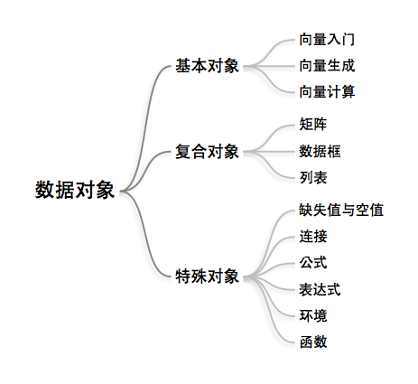

# 数据对象



## 向量 (Vector)

向量是 R 中最基本的數據對象，像一種容器存放不同的內容，如數值向量、邏輯向量、字符向量，但一個向量中必須只能放同質的內容。

## 複合對象

在向量的基礎上，可以建構三種重要的複合對象：矩陣、數據框、列表。絕大部分的數據分析都可以通過這三種數據對象來解決。

## 特殊對象

缺失值、空值、連接、公式、表達式、環境、函數。

## 練習
```shell
$ R --no-save < src/ch2.Rd
```
